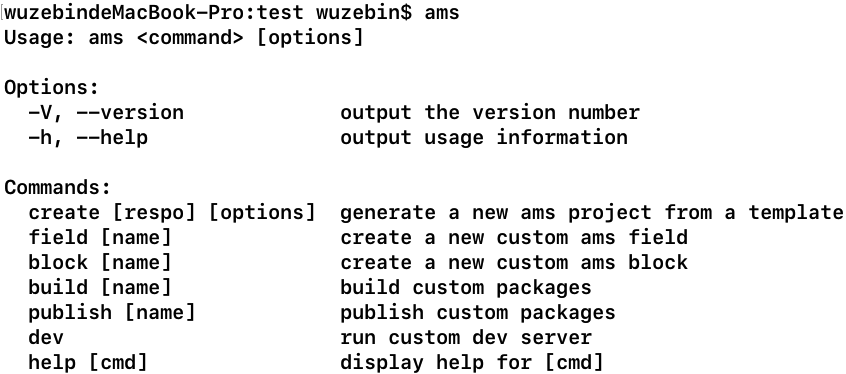

# cli工具

## 安装cli工具

```sh
npm i -g @ams-team/cli
```


## 创建一个ams项目
运行以下命令来创建一个新项目：

```sh
ams create hello-ams
```

你会被提示选取一个`模板`，`script` 的方式是通过`<script>`引用，不需要`node`环境


可以通过 `ams help create` 查看命令选项
