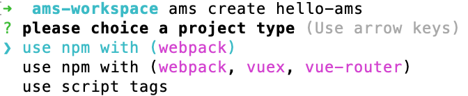

# cli工具

## 安装cli工具

```sh
npm i -g @ams-team/cli
```

## 创建一个ams项目
运行以下命令来创建一个新项目：

```sh
ams create hello-ams
```

::: warning
`windows` 环境下如果有报错，请尝试使用 `ams-create hello-ams` 替代（ams init、ams field、 ams block等同理），同时手动安装依赖，`cd hello-ams && npm i` (下个版本会解决windows兼容问题)
:::

你会被提示选取一个`模板`

`（webpack）simple`的方式是集成了webapck的简单项目

`（webpack and router）full`的方式是集成了webpack和router的项目

`（webpack and router and vuex）complete`的方式是集成了webpack、router和vuex的项目



可以通过 `ams help create` 查看命令选项
