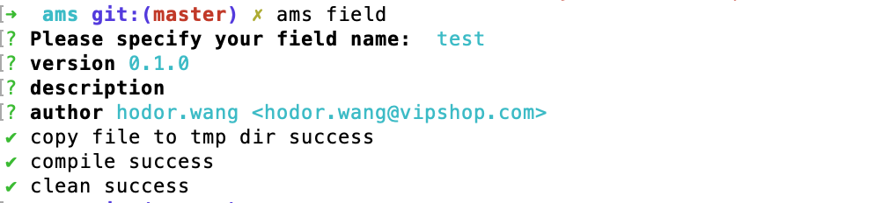
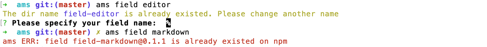
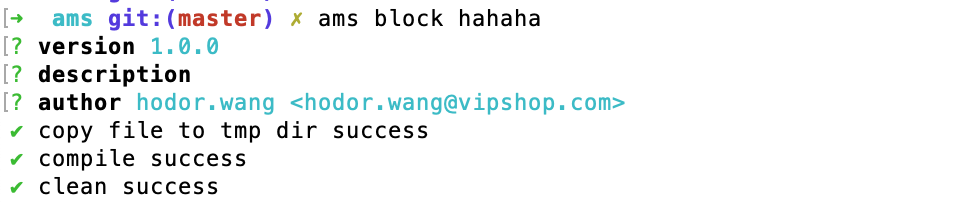
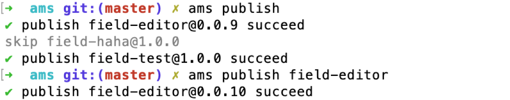

# 编写定制物料

AMS里面把区块（block）和字段（field）统称为物料

> 默认你已经安装cli工具，如果还没安装请移步[cli工具](/api/cli.html)

## 定制工作区目录结构

```
.
└── packages
    ├── field-test（定制field）
    │   ├── lib（打包发布目录）
    │   └── src
    │       ├── edit.vue 
    │       ├── view.vue
    │       ├── package.json
    │       └── index.js（模块入口）
    └── block-haha（定制block）
        ├── lib（打包发布目录）
        └── src  
            ├── block.vue
            ├── package.json
            └── index.js（模块入口）
```

## 新建定制field

通过`ams field`可以创建field



::: tip field命名规范
如果是业务相关定制模块如 `warehouse`，需要增加前缀 `vip-` 变成 `vip-warehouse`

通用模块不需要增加前缀，如 `editor`
:::

cli工具会校验本地是否已有同名field或者npm是否已有同名field



我们可以看到 `packages` 目录下会新增一个 `field-test` 目录，同时 `field-test/package.json` 会有一项`amsConfig`的配置

``` json {4,5,6,7,8}
{
    "name": "@ams-team/block-test",
    "version": "1.0.0",
    "amsConfig": {
        "externals": {
            "vuedraggable": "vuedraggable"
        }
    }
}
```

其它可用配置项

| 参数 | 类型 | 是否必填 | 默认值 | 说明
| -- | -- | -- | -- | -- |
| version | string | 是 | 无 | 模块版本号，以此配置为准，会覆盖package.json内的version
| publish | boolean | 否 | true | 是否发布
| externals | string \| object | 否 | '' | 排除打包模块，详见[webpack-externals](https://webpack.js.org/configuration/externals/)

每个`field`会有编辑（`edit`） 和 显示 (`view`) 两种状态，对应 `field-test/src/edit.vue` 和 `field-test/src/view.vue` 两个文件

在 `field-test` 定制模块内部可以通过 `@ams-team/ams` 引用 `ams` 暴露的` ams.utils` 和 `ams.mixins` 等

`mixins` 详见 [ams.mixins](../api/ams-mixins.md) 

``` js {2,5,9}
// field-test/src/view.vue
import ams from '@ams-team/ams';

export default {
    mixins: [ams.mixins.fieldViewMixin],

    computed: {
        dateString() {
            return ams.utils.parseTime(this.value)
        }
    }
}
```

编辑状态下，由于 `value` 是通过 `prop` 传入的不能通过 `v-model` 绑定，如果是使用v-model绑定要使用 `localValue` ，  `ams.mixins.fieldEditMixin` 会同步 `value` 和 `localValue`，并同步更新block对应数据项

`v-bind="field.props"` 会将field的props配置透传至节点

`mixins` 详见 [ams.mixins](../api/ams-mixins.md) 

``` js {3,5,12}
// field-test/src/edit.vue
<template>
    <el-date-picker v-model="localValue"
                    type="date"
                    v-bind="field.props" />
</template>

<script>
import ams from '@ams-team/ams';

export default {
    mixins: [ams.mixins.fieldEditMixin, ams.mixins.fieldDateGetSetMixin]
}
</script>
```

## 新建定制block

通过 `ams block` 可以创建block



::: tip block命名规范
如果是业务相关定制模块如 `warehouse`，需要增加前缀 `vip-` 变成 `vip-warehouse`

通用模块不需要增加前缀，如 `editor`
:::

其它方面和配置类似于上面 `ams field` 命令

## 定制模块本地调试预览

在 `定制工作区` 内运行 `npm run dev` 启动预览调试，通过 http://localhost:9527/ 查看

## 发布定制模块

通过 `ams publish` 可以发布所有定制模块，通过 `ams publish field-test` 可以发布单一定制模块



cli工具会跳过 `amsConfig` 配置的 `publish` 为 `false` 或者是线上版本号大于等于当前版本号的模块，如需要发布新版本请修改 `package.json` 内的 `version` 配置

## 可用定制模块列表

[npm模块列表](https://www.npmjs.com/search?q=%40ams-team) 内带 `@ams-team` scope的模块
